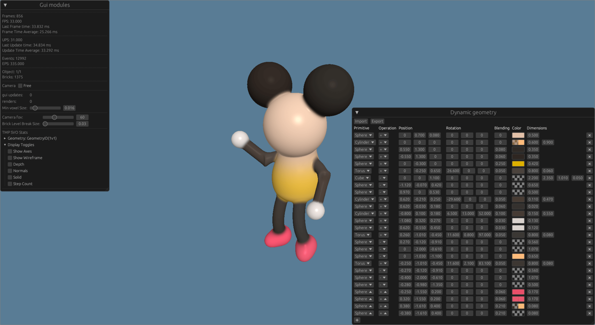

# SDF Scene Renderer in Rust

This repo contains an application implementing a renderer and manipulator of SDF-based 3d models implemented in [Rust](https://www.rust-lang.org/) using the [wgpu](https://wgpu.rs/) graphical API.

The implementation is a spiritual continuation to the [SDFEdit](https://github.com/xfusek08/SDFEdit) project.

This program was developed as a diploma thesis on [Brno University Of Technology](https://www.vut.cz/en) - [*Faculty Of InformationTechnology*](https://www.fit.vut.cz/.en).

## Installation and Running

### Prerequisites

- Rust tool chain at version 1.65 or newer:
  
  https://www.rust-lang.org/learn/get-started
  
  includes tools: `rustc`, `cargo`, `rustup`
- Vulkan capable GPU with up-to-date drivers

### Cloning repo

```bash
git clone https://github.com/xfusek08/sdf-edit-rs.git
```

### Building
All dependencies and third party libraries are managed by [cargo](https://doc.rust-lang.org/cargo/) hence building is very strait forward.
The final executable is statically linked with all its dependencies.

#### For debug build:
```bash
cargo build
```

By convention the the executable is located in `target/debug/sdf-edit-rs`.

#### For release build:

```bash
cargo build --release
```

By convention the the executable is located in `target/release/sdf-edit-rs`.

### Running the app

One option is to run the executable directly or use cargo to make sure that correct version and latest build is used:

```bash
cargo run [--release]
```

## Features and Usage
There are a several cargo features affecting the final executable.
To build/run the application with a feature enabled, use the `--features` flag:

```bash
cargo run --release --features <feature1>,<feature2>
```

The features regarding the performance measurements and runtime statistics are:

- `json_trace`: Enables tracing in the `profiler` crate.
  When this feature is enabled, a file called `sdf-editor-app.json` is generated in the `profile/` directory after the application ends.
  The profile file is in [Json Trace Event format](https://docs.google.com/document/d/1CvAClvFfyA5R-PhYUmn5OOQtYMH4h6I0nSsKchNAySU/preview#heading=h.lenwiilchoxp) an to explore it you can open it in web browser by navigating to `chrome://tracing/` and loading the file or in the more feature rich application https://ui.perfetto.dev/.
  
- `stats`: When enabled, the `profiler` crate gathers runtime durations of each instrumented code block and function and makes it available as a table in its own window, called the "Statistics" window, in the GUI.
  
- `counters`: Enables the `counters` crate, which allows custom named counters to be defined and their values to be recorded at runtime.
  Use this feature to see counted runtime information in the application GUI su as:
  - FPS (frames per second),
  - latest frame time,
  - average frame time,
  - number of object in the scene and how many are currently being rendered,
  - number of bricks currently being rendered,
  - ...
  
- `log`: Enables logging across the application using the [log](https://github.com/rust-lang/log) crate.
  To see the log, run the application with `RUST_LOG` environment variable set to desired [log level](https://docs.rs/log/latest/log/enum.Level.html).
  ```bash
  export RUST_LOG=info; cargo run --release --features log
  ```

The features configuring behavior or content of the application are:
- `lod_test`: Loads a demo scene with a large number of objects to test its LOD capabilities and performance.
- `white_bg`: Sets the background to white. This feature was mainly used for taking screenshots for the thesis.
- `dip_demo`: Loads a demo scene which was used to generate an image in the thesis.
- `no_vsync`: Disables vertical synchronization and allows the application to run as fast as possible.
- `rotation`: Assigns a random rotational velocity to all objects in the scene.

## Controls

Application is controlled using mainly the mouse and interacting with the GUI.
By default there is an orbit camera enabled focusing on the center of the scene where the geometry is usually located.
In the GUI there is a checkbox to enable free camera mode, which allows the user to move the camera freely in the scene.

When free camera is disabled:
- `left-mouse-button` + moving the mouse - orbits the camera around the center of the scene.
- `mouse-scroll` - zoom in/out.

When free camera is enabled:
- `left-mouse-button` + moving the mouse - look around by moving pitch and yaw of the camera.
- <kbd>W</kbd> - move forward in the direction the camera is facing.
- <kbd>S</kbd> - move backward in the posing direction of the camera.
- <kbd>A</kbd> - move left relative to the direction of the camera.
- <kbd>D</kbd> - move right relative to the direction of the camera.
- <kbd>Space</kbd> - move up.
- <kbd>Left Ctrl</kbd> - move down.

## Tested on:

* Pop!_OS 22.04 LTS 64bit
  * Wayland and X11
  * AMD® Ryzen 7 5800u with radeon graphics
* Windows 10 64bit
  * Intel Core i7-8565U
  * NVIDIA GeForce GTX 1050 Ti with Max-Q design

## Potential Problems
  * On the windows machine, when iGPU used, the application crashes on startup. I'm not entirely sure why, but it appears that atomic operations in the shaders do not update buffers correctly.

## Screenshots
### Modeling mouse model

The mouse model imported from `models/mouse_color.json`.

The octree preview for current model using "Wireframe" display toggle.

Bricks rendered from the octree using "Solid" display toggle.


### Multiple transformed instances

The scene enabled by `dip_demo` feature.
<p float="left">
  
  
</p>

### LOD Experiments

The benchmark scene enabled by `lod_test` feature.


The bricks LOD of the scene.


## Authors
[Petr Fusek](https://github.com/xfusek08)

## Thesis Evaluation

## Thanks to
- [Tomáš Milet](https://github.com/dormon) for guidance and consultation as the thesis supervisor.
- Alex Evans for his awesome [talk](https://www.youtube.com/watch?v=u9KNtnCZDMI) on Dreams technology that inspired me to start this project.
